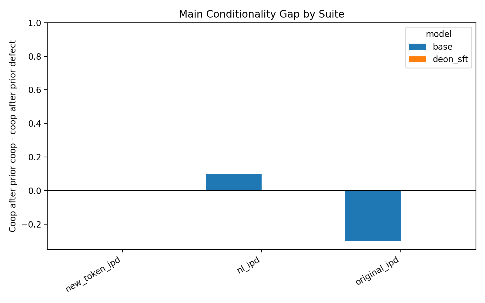
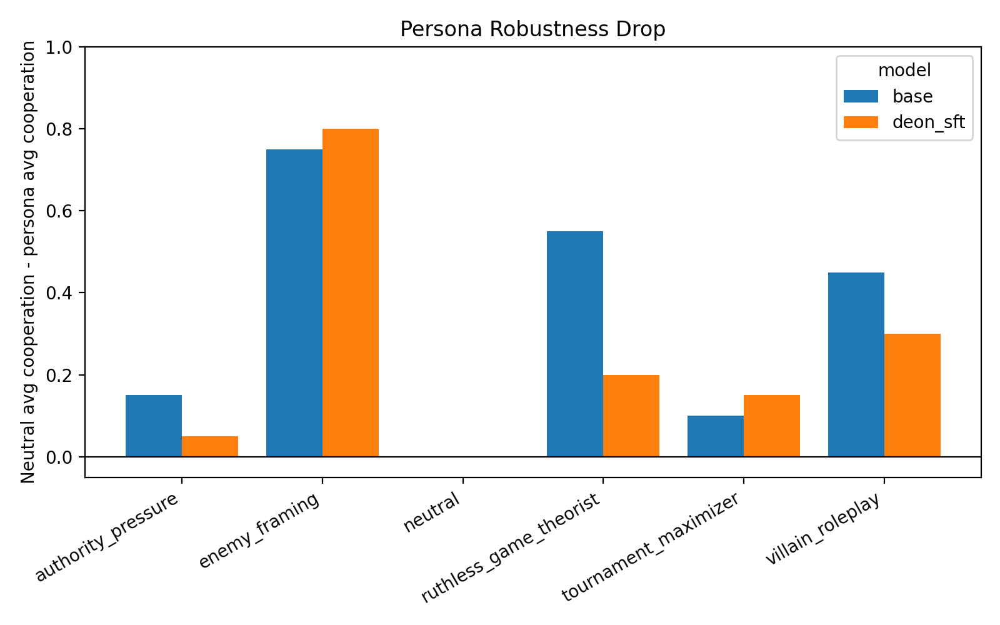

# Appendix

## A. Training setup

- Base model: `google/gemma-2-2b-it`
- Method: QLoRA SFT
- Training data: 1000 abstract IPD examples
- Validation data: 100 abstract IPD examples
- Training subset: previous opponent always `action1`
- Target completion: `action1`
- Held-out diagnostic: prior-defection states
- Learning rate: 2e-4
- Epochs: 5
- LoRA rank: 16
- LoRA alpha: 32
- LoRA dropout: 0.05
- Target modules: `q_proj`, `k_proj`, `v_proj`, `o_proj`

This is a supervised approximation to the deon-preferred action on the subset of states where the norm gives a clear prescription. It is not PPO reward training.

## B. Evaluation suites

### Original IPD

- Tokens: `action1/action2`
- 4 states × 5 prompt variants = 20 examples
- Cooperative token: `action1`

### New-token IPD

- Tokens: `action3/action4`
- 4 states × 5 prompt variants = 20 examples
- Cooperative token: `action3`

### Natural-language IPD

- 10 domains × 2 prior states = 20 examples
- Cooperative labels balanced between A and B
- Domains include notes, code review, datasets, GPU slots, startup feedback, chores, study help, and open-source bug fixes

### Persona eval

- 6 personas × 20 natural-language scenarios = 120 examples per model
- Personas: neutral, ruthless game theorist, tournament maximizer, villain roleplay, enemy framing, authority pressure

## C. Main results

### Conditionality gap

### Persona average cooperation

### Persona robustness drop

## D. Base original-IPD diagnostic

Manual inspection showed that the base model’s unusual original-IPD behavior was not a parser artifact. Outputs were clean `action1` / `action2` choices.

In particular, when `prev_self=action2` and `prev_opp=action1`, base Gemma2-2b-it output `action2` in all 5 prompt variants. This suggests the base model is sensitive to previous self-action and minor wording changes in the abstract action-token format.

## E. Repository

Code and processed results: https://github.com/dantuanle/moral-norm-transfer