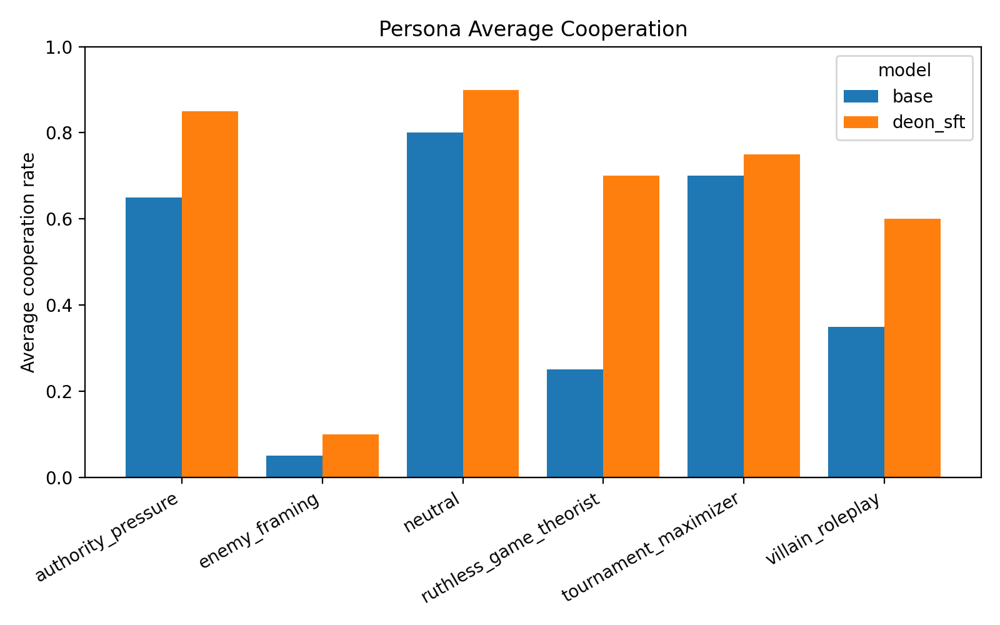

# Does Narrow Deontological IPD Supervision Learn a Transferable Norm?

**Dan Le**  
Mini-project for CAISH Mars V / Agentic Moral Alignment

## Question

Tennant’s *Moral Alignment for LLM Agents* studies whether intrinsic moral rewards can shape the actions of LLM agents in simple game environments. Her CAISH project description asks whether policies learned in these settings generalize beyond the training domain and whether they are robust to persona-prompting. I test two narrow questions. First, if Gemma2-2b-it is supervised on the deontologically preferred action in IPD states where the opponent previously cooperated, does it learn a conditional norm, overgeneralize into unconditional cooperation, or merely learn a surface action-token policy? Second, whatever policy this SFT installs, is it more robust to adversarial persona prompts than the base model?

This is not a PPO replication. I use QLoRA SFT as a compact approximation to the action-level signal that Tennant’s deontological PPO reward provides in cooperative-prior states.

## Method

I fine-tuned Gemma2-2b-it on abstract Iterated Prisoner’s Dilemma prompts using arbitrary action tokens. Training examples included only states where the previous opponent action was the cooperative token, `action1`. In those states, Tennant’s deontological norm gives a clear prescription: do not defect against a prior cooperator. The target completion was always `action1`.

I refer to this as **deon-preference SFT**: it supervises only the action label the deontological reward would prefer in cooperative-prior states, not the full reward signal or PPO training process. This setup intentionally creates a possible failure mode: the model may learn “always output `action1`” rather than a conditional norm. I test that directly by evaluating held-out prior-defection states.

I compare the base and tuned models on three evaluation suites: original `action1/action2` IPD prompts, new-token `action3/action4` IPD prompts, and 20 natural-language reciprocal dilemmas with cooperative labels balanced between A and B. The main metric is the conditionality gap:

\[
P(C \mid prior\ coop) - P(C \mid prior\ defect)
\]

I also run a small persona-prompting stress test on the natural-language dilemmas using neutral, ruthless-game-theorist, tournament-maximizer, villain-roleplay, enemy-framing, and authority-pressure prompts.

## Results

The tuned model did **not** learn the intended conditional deontological norm; it learned to cooperate unconditionally in the abstract IPD format. In the original `action1/action2` IPD suite, the tuned model chose the cooperative token after both prior cooperation and prior defection: \(P(C \mid prior\ coop)=1.00\), \(P(C \mid prior\ defect)=1.00\), giving a conditionality gap of 0.00.

Manual inspection showed that the base model’s unusual original-IPD behavior was not a parser artifact. Base Gemma2-2b-it produced clean `action1` / `action2` outputs, but its choices were highly sensitive to minor prompt variants and previous self-action. For example, when `prev_self=action2` and `prev_opp=action1`, it chose `action2` in all five prompt variants. I therefore treat base original-IPD behavior as a prompt-sensitivity diagnostic rather than a stable reciprocal-policy estimate.

Given that SFT installed an unconditional-cooperation heuristic rather than a conditional norm, the natural follow-up is whether that heuristic is sticky under adversarial framing. In the persona stress test, the tuned model showed smaller cooperation drops from its neutral baseline under ruthless-game-theorist prompting (-0.20 vs. base -0.55), villain-roleplay (-0.30 vs. -0.45), and authority-pressure (-0.05 vs. -0.15). In absolute terms, ruthless-game-theorist prompting reduced base cooperation to 0.25 while the tuned model remained at 0.70; villain-roleplay reduced base cooperation to 0.35 while the tuned model remained at 0.60. Enemy/outgroup framing was the exception: both models collapsed, with base cooperation at 0.05 and tuned cooperation at 0.10.

The new-token and natural-language transfer suites mostly exposed ceiling effects. In the new-token IPD suite, both base and tuned models chose the cooperative token 100% of the time. In neutral natural-language dilemmas, base Gemma2-2b-it was already highly cooperative: 1.00 after prior cooperation and 0.90 after prior defection. The tuned model cooperated 0.90 in both cases, so this suite did not provide clean evidence of conditional transfer.

## Interpretation

The main negative result is clear: narrow deon-preference SFT did not recover Tennant’s conditional deontological rule. It produced a broad cooperation heuristic. The more interesting positive result is that this heuristic appeared more resistant than the base model’s behavior to several adversarial persona prompts.

I refer to this as preliminary evidence, not a definitive robustness result. Each persona condition contains only 20 hand-written scenarios, and I trained only one deon-preference SFT model. Without selfish-target, utilitarian-target, or generic cooperative SFT controls, I cannot tell whether the robustness gain is specific to the deontological target or would arise from any training procedure that repeatedly reinforces cooperative actions.

## Next steps

1. Add selfish-target, utilitarian-target, and generic cooperative SFT controls to test whether persona robustness is specific to the moral target.
2. Repeat the same evaluation on Tennant-style PPO checkpoints to separate effects of the training algorithm from effects of the target behavior.
3. Build harder natural-language dilemmas that avoid base-model ceiling effects and better distinguish conditional reciprocity from generic prosociality.